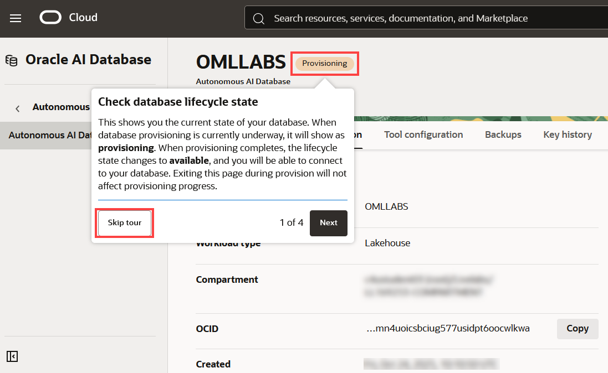
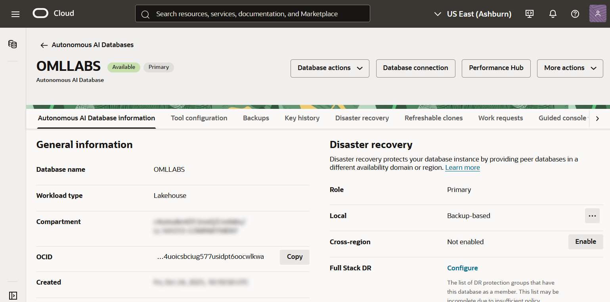

<!--
    {
        "name":"Provision an Autonomous Database",
        "description":"Steps to provision an autonomous database"
    }
-->

To provision an Oracle Autonomous Database:

1. Sign into your OCI account, and under the Build section, click **Create an ADW database**.

	

	 Alternatively, you may click the Cloud menu icon on the upper left corner. This opens the left nagivation menu. Click **Oracle Database** and then click **Autonomous Database**.

	

2. On the Autonomous Databases page, click **Compartment** to select a compartment. By default, it will show the root compartment. Click **Create Autonomous Database**. This opens the _Create Autonomous Database Serverless_ page.

   

    > **Note:** You must select your **OCI Home Region** if you intend on creating an Always-Free Autonomous Database.

     

3. On the *Create Autonomous Database Serverless* page, provide the basic information about the database. By default, a database name and a display name for the database are provided. You can modify these names to enter a user-friendly display name for the ADB instance to easily identify the resource. The display name does not have to be unique.    

   > **Note:** We will choose the Display Name *OMLLABS* and the Database Name *OMLLABS* for our example.  You can use the same or create your own, but neither supports blank spaces in the name

   

4. For Workload Type, select **Data Warehouse**.

   

5. For Database Configuration, select **Always Free**. 

    * For the Always Free option, both releases 19c and 23ai are available.  Let’s use the default **23ai**.  You can create **Always Free** resources both in Free Tier and Paid accounts, with the requirement of it being created in your **OCI Home Region** as mentioned above in Task 2.

        
   
    * If you are using a standard **Paid Account** and decide to provision a **paid database** instead of an **Always Free**, you will see more options available that include ECPU count, Compute auto scaling and Storage auto scaling. For this workshop **the minimum compute unit of 2 ECPUs with auto scaling is sufficient**.  If you decide to use a **Developer Database** option, it already has the configuration necessary for this workshop.

        > 

	    > You will also be offered an **Immutable Backup Retention** plan billed separately. This option is not available in the Always Free Autonomous Database, that you can adjust as you see necessary.  We will not be using backups in this workshop, so you can easily put it to a minimum of 1 day without issues.

        > 

    * The Advanced options - **Compute Model** and **Bring your own license** are available only for a paid version.   

         

6. Create your Autonomous Database administrator credentials by providing a password. You will need these credentials to sign into this Autonomous Database instance.   

	> **Note:** The default administrator username is ADMIN. The ADMIN password must be 12 to 30 characters and contain at least one uppercase letter, one lowercase letter, and one number. The password cannot contain the double quote (") character or the username "admin".

	

7. For network access, select **Allow secure access from everywhere.**

    

8. In the **Contacts for operational notifications and announcements** section, provide your email ID for any notifications and announcements. You also have the option to add additional email IDs by clicking **Add customer contact**.

	 

9. Under Advanced Options, the following options are available:
    * **Encryption Key:** 
        
        * **Encrypt using an Oracle-managed key:** By default, Autonomous Database uses Oracle-managed encryption keys. Using Oracle-managed keys, Autonomous Database creates and manages the encryption keys that protect your data and Oracle handles rotation of the TDE master key. We will use this option for this workshop. 
        * **Encrypt using a customer managed-key in this tenancy**
        * **Encrypt using a customer managed-key in a different tenancy** 
    * **Maintenance:** By default, the patch level is set to _Regular_ for an Always Free database. 
    * **Tools:** The following tools are enabled for an Always Free database - Oracle APEX, Database Actions, Graph Studio, Oracle Machine Learning user interface, Data Transforms, and Web Access. 
        
        > **Note:** You cannot edit the configuration of these tools for an Always Free database. 
    * **Security Attributes:** You can add a security attribute to control access for your resources using Zero Trust Packet Routing (ZPR) policies. To enter security attributes during provisioning, you must already have set up security attributes with Zero Trust Packet Routing. You also can add security attributes after provisioning. For this workshop, we will leave this field as is. 
    * **Tags:** If you want to use **Tags**, enter the **Tag key** and **Tag value**. Tagging is a metadata system that allows you to organize and track resources within your tenancy. Tags are composed of keys and values which can be attached to resources. The options are:
        * In Namespace, if you select **None (free-form)**, enter a **Key** and add a **Value** to it. 
        * In Namespace, if you select **Oracle-tags** you have the option to choose _CreatedBy_ or _CreatedOn_ in the **Key** field. Assign a value to the selected key, as applicable. 
        

10. Click **Create**.  The Oracle Autonomous Database instance starts provisioning. It will show the status **Provisioning**. .
    

    Once the provisioning is complete, the database details are listed with the status Available.

	  

This completes the task of provisioning an Oracle Autonomous Database.

